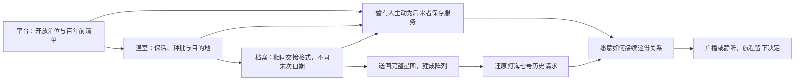

# 《留灯之人》内容与制作约束

2026-09-21 · 世界观 v1 的首章落地稿。沿用当前十封通讯、六课教学、三节点和六模块。此文中的新增文本、场景物件与音效均为待制作内容，没有写入运行时或替换现有影片。

## 1. 新玩家最先需要知道的三件事

**这是你们七个人的家园。先让生活循环稳定，再出去寻找补给。**

标题页与开场只承担这三件事。玩家不需要先学习三类机构、值守公约全文、失联历史和另外五个名字。界面仍用直白操作名“新游戏／继续航程”；档案名称与摘要承担存读档识别，不用让玩家先填一份世界观问卷。

24 秒开场继续采用既有尺度递进：珠母星与小小的方舟 → 方舟艉部与泊位 → 先遣艇和停稳的镜头。新增世界观不要求把这些镜头重新拍成历史蒙太奇。开场旁白仍由已苏醒的岑宁承担；闻舟不能提前出现。舱门、夹具和后建模块的状态遵循实际开局。

**开场后第一条可选文字提案**：

> 潮汐之庭没有回应。船上的七个人都已报到。岑宁正在等你的建设安排：先接好循环舱，让下一次归来有更充裕的生活储备。

本段用于语气和信息量参考，不必与已有 `awakening` 来信同时弹出。

## 2. 信息按行为递进

| 阶段 | 本次只要求玩家理解 | 可以自愿多看一层 | 留到以后 |
| --- | --- | --- | --- |
| 接管方舟 | 舰长、七个人、循环舱 | 岑宁与林芽在做什么 | 所有人物名册、宏观历史 |
| 首航准备 | 带修复构件，保留返航能力 | 先遣艇为何负责现场确认 | 公约与网络组织结构 |
| 平台接管 | 现货可以装走，必须带回 | 有人把水箱留给后来者，日期超过百年 | 所有人去了哪里 |
| 首次归航 | 本次劳动改变了家园 | 旧构件的来历被保留 | 新聚落与外交 |
| 温室与物流 | 减耗、产出、运输各自有用 | 种子有原本的目的地 | 生物多样性的长期选择系统 |
| 新住舱 | 两人醒来，需要更多照管 | 闻舟与陶禾的习惯 | 个人技能树与关系模拟 |
| 星图与阵列 | 记录有年代，远方需要验证 | 三站原属一套协作网络 | 跨区域最初失联诱因 |
| 舰长决议 | 广播或静听，本次决定记入航程 | 船员如何理解这份选择 | 尚未实现的派系反应与航区开放 |

新术语第一次出现要附带可见事物。“灯塔网络”先由三座已经去过的站构成，再出现名称。不要先说名词再要求玩家记忆定义。通讯可跳读、重读；系统操作条件必须在操作处解释，不能藏在剧情正文里。

## 3. 内容卡：规则如何变成一次经历

下列卡片以游戏事件定位，不绑定绝对分钟数。每张卡的“新增”都尚未实施。当前经济奖励继续来自教程系统，阅读剧情不另发物资。

### WB-01　风扇与第一份余裕

- **依据与触发**：W02/W03；现有 `life` 在循环舱建成后解锁。
- **现有收益**：循环舱运行时维生消耗减半；课程奖励按已有规则领取。
- **新增表现**：启用并实际运行时，循环舱进风声稳定下来；建设但待机时只表现安装完成。不能用运行声掩盖缺人、缺电。
- **短文案候选**：“风扇比想象中响。没人叫它安静——这意味着下一杯水有了着落。”
- **玩家可复述**：我改善了船上的生活，而不是收到一个与世界无关的升级点。

### WB-02　无人接班的门

- **依据与触发**：W01/W06；现有 `wreck`，勘测并接管断环平台。
- **现有收益**：可访问的节点库存、装货与后续运输；用掉的是艇上修复构件。
- **新增场景证据**：一处关闭的普通抱架、一处仍被照料的公共接驳面、一张留空接班栏的清单。三者都服务同一个局部故事，不另开三个收集任务。
- **短文案候选**：“末次交接：工具已归位，应急水箱开放。接班人：——”
- **年代口径**：游戏已有对白确认清单超过百年。新增标签不随意再给一个精确公历年份；年代换算通过通讯提供。
- **玩家可复述**：灯不是活人证明，但有人留下了对陌生人的安排。

### WB-03　带回来的东西有了去处

- **依据与触发**：W02/W07；现有 `home` 随首次带货归航解锁。
- **现有收益**：货物与剩余推进剂正式入库，可以建设；“归航者”奖励独立领取。
- **新增表现**：港内卸载提示对应本次真实数量；本次库存不够建设时，角色只确认归来，不能预告新舱已经建成。
- **新增物件**：下一次实际建成的模块，其检修盖内保留平台来源标记；来源追踪尚未实现前，只作概念资产，不自动声称某一块原料来自那一站。
- **短文案候选**：“人回来了，货也到了。仓库已经记账。今晚可以认真商量下一件事。”
- **玩家可复述**：出航的收益必须被带回，也被船上的人看见。

### WB-04　未送达的春天

- **依据与触发**：W02/W06；现有 `garden`，温室被接管。
- **现有收益**：初存生活物资，以及接管后的定期生产；取回仍需要载运。
- **新增场景证据**：六瓣中明确一处封存、一处工作、一处保存种源；包装上留有目的地字段而非神秘符文。状态分区不能遮掉实际可用交互口。
- **可选标签候选**：“批次：耐盐叶菜。去处：下一处居住站。附注：第一批留种。”
- **林芽的短回应候选**：“它们没有等到收件人。我们先让这一批继续长，去处可以慢慢查。”
- **玩家可复述**：这座站保存的是未来生活的可能，也能解决眼前的食物需求。

### WB-05　夜班表与两张床

- **依据与触发**：W03；现有 `network` 与 `waking` 是两个独立事件。
- **现有收益**：稳定家园里程碑；住舱建成后增加两名专业人员，维生需求同步增加。
- **新增表现**：稳定供应对应一次值班安排变化，苏醒对应两人的报到。没有舰内角色动画时，用通讯与准确人口反馈表达，不假称已经能看见人物行走。
- **顺序规则**：跳过教学后允许先建住舱。`network` 应根据两人是否已经醒来提供不同措辞，或使用不预言先后顺序的文字。
- **中性短文案候选**：“这两条供应线让夜班轻松了一些。住舱和储备一起准备好，我们才有能力让更多人加入生活。”
- **新增人物介绍**：闻舟维持现有来信；陶禾首次只署名报到，不增加第二个立即弹出的长对话。

### WB-06　地图上的日期

- **依据与触发**：W04/W05；现有 `archive` 要求知识已送回方舟。
- **现有收益**：取得知识，满足远望阵列的一项前置；完整数据不占货格。
- **新增证据**：三个节点使用同一交接格式，但最后记录的时间不同；设备标记区分“可读取”“已核验”“需复测”。
- **短文案候选**：“图上仍连着三条线。它们最后一次被确认，却不在同一年。”
- **边界**：接管时只能说取得数据，返港后才说方舟已核验。不能从货运到账推导星图已取得。
- **玩家可复述**：找到旧图不等于知道今天可以安全去哪里。

### WB-07　听见与证实

- **依据与触发**：W08；现有 `signal` 在阵列建成后解锁。
- **现有内容**：“灯海七号。值守席空缺。接替请求仍然有效。”明确标注历史录音。
- **新增呈现**：标题旁直接标“历史档案还原”；播放开始和结束都保留年代状态。不要加实时波形倒计时、红色求救闪烁或“仅剩十分钟”。
- **发现回报**：玩家回答了“这里曾怎样相互照管”，得到一个值得调查的新坐标；不是立刻获得神奇引擎。
- **玩家可复述**：我想知道那里现在怎样，但不用为一份旧录音立刻牺牲当前航程。

### WB-08　新的交接记录

- **依据与触发**：W06/W08；现有 `departure`，曾达成远征准备里程碑，当前安全停泊、无救援进行，仍有阵列和知识，且尚未决定。该里程碑永久保留，不在决议时重新检查全部库存与模块运行状态。
- **现有后果**：广播或静听永久记入当前航程，改变回信；不额外扣储备，不触发敌人，不开启下一航区。
- **新增表现**：交接记录末尾出现本次决定与舰长档案标题的引用；具体如何引用需由后续界面设计确定，避免覆盖玩家自定存档名。
- **写作约束**：广播表达愿意被找到；静听表达先取得更多证据。两者都不嘲讽玩家，也不用奖惩暗示唯一正确道德答案。
- **玩家可复述**：这一次我如何面对未知，成为了家园历史的一部分。

## 4. 线索关系

图表示新增叙事关联与现有进程的结合，不要求玩家按唯一空间顺序阅读所有标签。关键结论由环境、任务反馈和可重读通讯三处承接。自动货运可以接替重复劳动；重复装货不重复播放第一次发现的完整剧情。

## 5. 当前机制对照表

此表为本轮从代码读取的实现快照，方便作者核对。精确数值以后以代码和测试为准，不作为永不调整的宇宙常数。

| 项目 | 当前规则 | 写作不应承诺的能力 |
| --- | --- | --- |
| 开局 | 8生活物资、9构件、14推进剂；6专业岗位＋舰长 | 七人之外另有一组免费岗位 |
| 基础能力 | 基础维生2人2电；总电力4 | 开局没有供能或无法呼吸 |
| 循环／货运／精炼 | 各运行占2人2电，出航或救援另需1人 | 自动化意味着无人维护、所有模块总能全开 |
| 太阳翼 | 两级，每级增加2电力 | 当前未模拟的昼夜停电、风暴发电波动 |
| 新住舱 | 苏醒2人，岗位6→8，总人口7→9 | 出生、新移民到访、独立职业加成 |
| 断环平台现货 | 4物资、24构件、40推进剂；无再生 | 无穷库存或已经有拆站采矿系统 |
| 温室现货与产出 | 初存12物资；接管后每240秒新增4，上限48 | 无人时已经积累百年无限粮食；玩家关模块能遥控其能源 |
| 档案站现货 | 6物资、40构件、12推进剂；无再生 | 下载星图自动增加基地库存 |
| 现场接管 | 140米内勘测8秒，使用艇载1构件 | 远处点图标即可完成实体修复 |
| 装载与运输 | 先遣艇12格；货船每240秒运4，发车消耗1推进剂 | 在途货物已经可用于建造 |
| 精炼 | 每240秒1构件转3推进剂；基地燃料到18时待机 | 凭空制造、普通钢梁直接炼油、无限自给 |
| 星图 | 随艇携带、不占货格；返港取得知识；遇救援留在箱中 | 普通货船送回星图、远程摘要等同完整数据 |
| 教学奖励 | 六课合计3物资、4构件、4油，一次领取 | 读信刷物资、重复建设重复领奖 |
| 章末决定 | 只记录决定和不同回信 | 已经发生外交、战斗或星际跃迁 |

## 6. 既有资产与镜头的一致性记录

**本节记录旧版资产身份，适用于维护现有实机与影片。** 上一轮生成影片出现方舟舰桥形态漂移，需要用同一资产的多视图检查。但用户现已提出重新审视宇宙方舟的使命、科技背景和总体设计，下表的218米比例、楔形长脊、双主驱与旧泊口位置不再是新方案不可改变的前提。新方案依据[科技纪元与方舟设计依据](07-科技纪元与方舟设计依据.md)推导，选定后再建立它自己的身份板。

| 对象 | 旧版身份记录 | 值得增加的世界细节 | 旧版一致性验收问题 |
| --- | --- | --- | --- |
| 归航号 | 基础船约218×84×55m的资产比例；连续长脊、前尖后宽、偏置角形舰桥、双大主驱与一小辅驱、中央凹入泊口 | 三层历史：原厂板缝、替换维修件、当前封存或启用状态 | 同一方向剪接时，舰桥、喷口与泊位是否仍是同一艘船？ |
| 先遣艇 | 沿用 Surveyor 轮廓与中央低座舱；与方舟有同源接口，不只靠缩放区分 | 可辨认的装载口、维修点与接触磨损 | 中近景能否认出玩家驾驶对象？ |
| 07泊舱 | 沿用现有夹具、导引线、双开门、艇的朝向与交接机位 | 一个可维护的墙面、一组安全线、一副有使用痕迹的夹具 | 工作光、安全色和可行动方向是否比装饰更清晰？ |
| 断环平台 | 双C抱架、开放货仓、断裂处的结构因果 | 公共接口被保养，非必要结构被停用 | 不读字能否看懂它曾接待和装卸？ |
| 温室站 | 六瓣压力舱、可隔离结构、受保护透明面 | 封存／保活／生产分区，批次与去向标记 | 是否像能够运转的生态设施，而非发绿光的货仓？ |
| 档案站 | 数据核、偏心观测弧、离轴光学仪器 | 不同年代模块、校准刻度和受保护接口 | 是否像记录与观测设施，而非魔法环？ |

三个状态分别验：远景只读轮廓，中景读用途，近景读人的痕迹。先做一处材质样板在 Blender 与 Unity 同机位对照，确认粗糙度、光向、接触阴影和亮部不过曝，再扩充细节。现有独立泊舱呈现场景大于外部实际容积，继续用切镜交接；解决空间工程前不许承诺连续穿舱的一镜到底。

开局资产只装 `base`；新增六模块依真实建设显示。太阳翼不是散热器，基础采能不是后建太阳翼；三者造型和发光应能区分。不得为镜头“更完整”提前装满后期文明。

上段描述当前实现。新方舟必要的休眠保全、基础生命支持与长期能源属于任务本体，不应为了保留旧六个建设按钮而被抹去。若采用大方舟方案，必须逐项定义启用、修复和增建，并迁移外观与状态含义，不能直接声称现有六模块已经支持。

## 7. 正典冲突与迁移记录

| 编号 | 本轮发现及依据 | 文档侧决定 | 运行时状态／后续行动 |
| --- | --- | --- | --- |
| C01 | 母船开局日志“归航”、剧情“归航号”，实体“ARK07/流明方舟”，HUD“ASTERION” | 后续创作统一“归航号”，类型“远航方舟”；旧开发名不强行解释成四层世界历史 | 尚未替换 HUD、对象名或视频文字；涉及资产 ID 时保留内部兼容 |
| C02 | 小艇对象“ASTER”，源资产“Surveyor”；“拾光者”同时是教学徽记 | 玩家侧统一称“先遣艇”；不新增正式船名 | 不改 Prefab、文件名或存档键 |
| C03 | 标题“远航计划/THE VOYAGER INITIATIVE”未有组织定义 | 暂作为标题包装旧文案，不据此发明统治银河的组织 | 后续标题文案应收敛；此词不进入首章必记词表 |
| C04 | 平台最后清单超过百年，短版说“失联时间无定论” | 局部记录有年代；整个网络没有确认同一个失联日 | 无须删掉既有百年证据，后续文案保持范围清楚 |
| C05 | `network`、`waking`独立触发，自由建设可先苏醒，后读到未来时介绍 | 推荐顺序不写成硬历史；补分支或改成时序中性措辞 | 静态检查发现的可达风险，尚未修代码或运行复现；实现时测试先苏醒再稳定、正常教学和旧档补记 |
| C06 | 旧提案二十分钟首章到稳定供应；当前章还有住舱、档案、阵列和决议 | 当前《留灯之人》范围为准 | 旧稿保留历史身份，不据旧时长承诺本章游玩时长 |
| C07 | 文本“休眠温室”与 Catalog“休眠温室站”有长短写法 | 正式名“休眠温室站”，正文可简称“温室／休眠温室” | 界面迁移时保持同一地点 ID，不创造第四座站 |
| C08 | 218米旧母舰与新宇宙方舟使命尚无容量、动力和重力论证 | 撤回旧轮廓对新概念的硬锁；科技、人口与总体结构以07提案研究 | 当前模型、相机、数值与旧档均未迁移；正式采纳后重做尺度、港口/航路和六模块语义检查 |

本轮只交付研究与设计，不把这些迁移项描述成已修复。后续改文案仍应保留语义 ID、发现位与决议值，避免使旧航程丢失进度。

结合 内部参考项目 参考补充的[运行反馈合同](05-最小世界观资产包.md#e-运行反馈合同)，进一步约束 WB-01、WB-05、WB-06、WB-08 的状态输入、即时表现、持久记录与重读行为。

## 8. 证据入口与制作验收

当前事实主要核对这些源文件：

- [Catalog](../Assets/StellarEchoes/Scripts/Domain/Catalog.cs)：模块、地点与前置。
- [CampaignSimulation](../Assets/StellarEchoes/Scripts/Domain/CampaignSimulation.cs)：库存、岗位、生产、接管、救援、知识交付。
- [StoryCampaign](../Assets/StellarEchoes/Scripts/Domain/StoryCampaign.cs)：十封通讯、触发与章末决定。
- [ExpeditionWorld](../Assets/StellarEchoes/Scripts/Runtime/ExpeditionWorld.cs) 与 [HUD](../Assets/StellarEchoes/Scripts/Runtime/ExpeditionHUD.cs)：现有名称与场景对象。
- [方舟制作源](../ArtSource/ark_builder.py)、[空间站交付记录](../ArtSource/stations/stations-delivery.md)、[开场视觉约束](../../cinematic-experiment-01/story/视觉设定册.md)：资产身份与开局阶段。

制作优先级为：统一玩家看到的名称与修正通讯时态 → 完成平台一处环境叙事样板 → 扩展温室与档案站的职责语言 → 完成九人关系的小场景 → 再设计实际可到达的第二航区。

每次扩展按四个条件验收：

1. 关闭长日志，仍能从场景和反馈理解当下目标。
2. 跳过教学、先做后做、重读和读取旧档时，文本不虚构未发生的事。
3. 消耗、收益和人物状态与真实游戏状态相符；新增表现可区分建成、待机、运行。
4. 本章至少交付一个局部答案，以及一件由玩家行为改变的可见事物。

本轮验证是源文件核对、文本一致性审读与文档链接检查；上面的场景与玩家验收仍待制作，不引用上一轮影片播放成功替代它们。
