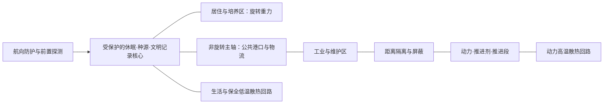

# 科技纪元与宇宙方舟设计依据

2026-09-21 · 初版技术提案及历史使命记录 · 技术候选待按新使命复评

**替代关系：** 用户已接受[11·归航号使命与生活设计基线](11-归航号使命与生活设计基线.md)。归航号现在以无可依赖母港的独立文明家园、持续生活与探索为主使命。本页§1、§5、§6保留原“休眠迁徙方舟”的推导，**已被替代，不再推荐为主使命**；迁徙只能是可能经历或阶段选择。纪元、速度、人口、尺寸、重力和百年休眠均未获一并确认，须重估它们对清醒生活与关系连续性的后果。

**现状：此前没有完成科技纪元和方舟使命的定义。** 已有稿规定了休眠、资源与维护的若干边界，却留白总人口、航程和纪年，也没有确定动力、重力、生态与工业能力。218米来自旧模型，并非容量、功率或任务分析的结果。原模型生成器将其描述为重型远征母舰；第一轮手稿主要是在延续该外壳。

本文提出一组可用于重新推导大形的假设，不冒称它们已获用户确认或已经实现。物理依据、未来技术许可和当前游戏行为分别记录。**旧轮廓、双主驱和218米尺寸不再约束新方舟的概念设计。** 旧资产仍保留给原版运行与历史影片的一致性检查。

**美术方向补充：** 用户进一步指出现稿缺少科幻美。本文件提供技术候选，不以完成全部工程推导作为开始美术探索的前置条件。情感意图、独特轮廓与方舟使命应共同建立，再与结构和技术能力往返校准。三种新视觉方向见[方舟科幻美术方向](08-方舟科幻美术方向.md)。

## 1. 旧使命比较：方舟保存什么（已被替代）

方舟没有唯一的常见外形。不同使命会导出完全不同的结构，不能由一个名字直接推导出巨型圆环。

| 使命类型 | 需要优先保存的东西 | 设计后果 | 对本作的适配 |
| --- | --- | --- | --- |
| 种子方舟 | 生物样本、知识、自动播种/建造能力 | 有效载荷可以紧凑，未必有大量日常生活空间 | 容易弱化现有船员关系与家园建设，不作为主方向 |
| 世代方舟 | 一直生活、生育并传承文化的完整社会 | 长期居住、生态、教育、公共空间与制度都是核心载荷 | 史诗感强，但需要重新定义休眠与七人开局的地位 |
| **休眠迁徙方舟** | **一个可重新苏醒的社区、种源、知识和重建能力** | **受保护的休眠核心＋可分阶段恢复的居住/生态区＋工业与维护系统** | **当时推荐，现已被11的持续生活使命替代；保留为旧方案推导** |

**旧建议，非现行使命：** 将一个社区及其重建能力送到可重新建立生活的地点，也能在目的地不再可信时成为长期过渡家园。旧建议不代表已确定归航号的起源。现行家园不以抵达一处终点才兑现意义；其他人类共同体仍可能存在，孤独不构成全宇宙无人的结论。

开局七人是到站后的第一班苏醒人员；九人是首章照管能力的进展，不是全船容量。更大人口与对应空间是本提案的新内容，不能由这句话自动成为运行时事实。

## 2. 未来纪元候选（需复评）

**时代名候选：星际散居纪，公元3400年前后。** 这是创作时间锚，不是对现实科技时间表的预测。具体日期尚不写进 UI 或存档。

一句话能力定位：**能够在太空建造大型居住与工业系统，能够跨越邻近恒星之间的距离，但仍受时间、物质、热和维护能力约束。**

旧技术提案的虚构历史分期候选，未确定归航号自身起源：

- **太阳系工业形成期，约24—27世纪：** 轨道建造、资源加工、空间居住逐步规模化；基本技术与制造标准开始跨聚落通用。
- **早期星际迁徙期，约28—31世纪：** 长期休眠、自治维护和高能推进成为昂贵的系统能力；第一批迁徙以代际尺度到达邻近恒星。
- **散居与接续期，约32—34世纪：** 不同地方各自发展，航行与消息延迟使地方自主成为常态；公共接口、补给与记录交换维系联系。潮汐之庭在这个阶段逐步失去接班。

这是一片邻近恒星之间逐步长出的文明，不是已经把银河每个角落都变成短途通勤的帝国。它懂得很多，却无法让任何一艘孤船独立复制全部工业链。知识留存与制造能力中断可以同时成立，因此回收和接续仍有意义。

## 3. 科技能力、代价与可见后果

本表是**待复评的创作假设**。大规模成熟聚变、长期可逆人类休眠、数百年自治维护等属于科幻能力候选，不是已验证的现实工程。新使命先要求持续生活、稳定与探索成立，再决定采用哪些能力及其代价。

| 技术域 | 这个文明建议能做什么 | 仍付出什么代价／不能默认什么 | 方舟上必须看得见什么 |
| --- | --- | --- | --- |
| 建造与材料 | 在轨装配公里级承力结构，制造可更换压力舱和大型热控件 | 不在行星地表一次发射整船；材料、接头和疲劳都要管理 | 总体分段、承力节点、检修路径、装配与更换空间 |
| 能源 | 成熟聚变支撑高功率阶段，独立冗余基载电源照管保全系统 | 能源、推进剂、可交付电力和散热能力不是同一个数；没有无限能源 | 动力区、屏蔽与距离隔离、输能通道、独立散热回路 |
| 推进 | 星际船拥有高排气速度的聚变推进；近域由专门飞行器完成高频作业 | 消耗反应物/推进储备；加减速与制动都要预算；不随意给出恒定1g全年推力 | 大尺度推进段与储备体积；人员区避开危险方向；姿态控制独立可辨 |
| 星际交通 | 原方案以0.02c研究长期亚光速迁徙，现保留为重大跨星选择的候选 | 未完成推力、质量比、功率与寿命闭合；不能把日常生活节奏强行交给旧速度输入 | 长程防护与保全需和持续生活空间共同预算，不预设全船仅为休眠航行服务 |
| 通信 | 光学与无线电定向链路、可追溯档案和当地网络 | 跨恒星信息有传播延迟；本提案不采用超光速实时通信 | 指向与校准设备、来源记录、年代标记，不是永远满格的全宇宙频道 |
| 重力 | 居住区通过旋转提供人工重力，轴线物流区保持低重力工况 | 不采用无代价重力地板和惯性消除；旋转连接、动平衡、维护有成本 | 具有真实半径的居住环/筒、轴承与连接；不同区域的“地板方向”明确 |
| 休眠与医疗 | 分区保全与可逆苏醒；百年尺度仍为重大航程的科幻能力候选 | 持续清醒班底与关系连续性优先；不能用每站休眠抹掉生活，保全仍耗能且需要防护维护 | 清醒成员的日常医疗、康复与隔离同样占据空间，休眠不是唯一主载荷 |
| 生态与食物 | 高比例回收水和空气，化学循环与生物生产协同，保存多样种源 | 不是一盆植物养活全船；不能保证全部物质永久闭环；储备、微量补充和病害隔离仍重要 | 种源冷库、可隔离培养区、水/气处理、营养与废物通路 |
| 工业与自动化 | 机器人巡检，按标准件制造和修理，处理已知故障，维护低功耗设施 | 不能从任意垃圾制造任意精密器件；没有无限自复制。未知局势与价值取舍由人处理 | 工场、料库、机械作业通道、替换件和吊运设施 |
| 导航与防护 | 提前观测、航路校验、分层防护和局部隔离 | 高速尘埃与长期辐射不能被一句“有护盾”消除；防护厚度需按载荷另算 | 航向牺牲层、受保护的生命与记录区、局部避难空间；光学仪器避开热/喷流污染 |

“无超光速”是这组新提案选择，不是此前已经写死的整个宇宙真理。若产品选择快速跨恒星的节奏，应重新定义带代价的超光速机制，并重算交通、通信与社会关系；不能只加一个跃迁按钮却保留所有旧因果。

## 4. 数量级怎样约束美术

下面是说明依赖关系的计算例，不是方舟工程验收：

- **航程：** 4光年距离，若全程维持0.02c匀速，约需200年；以0.02c为速度上限时，这是忽略加减速的理想下界。加减速也占据航程距离，实际总时间应按各阶段重新积分，再考虑绕行。这是原迁徙研究的时间代价算例，不是现行日常循环。采用百年跨星前必须说明人物关系、时间与去留后果；当前近域玩法不因此增加现实等待。
- **重力：** 对旋转居住区用 `a = ω²r`。半径250米、目标1g，对应约1.89转/分钟。环的500米直径由这组输入产生；它不是画面装饰，也不表示已经验证了人体长期适应、振动与轴承寿命。
- **散热：** 理想化深空环境中 `Q ≈ εσAT⁴`。只以10MW废热、发射率0.9作例，350K时约需13,100平方米总有效发射面积，600K时约1,510平方米。总发射面积并非单面展开投影面积，还未算互相遮挡。不同冷却回路承受不同温度，不能把生活区一律升至600K来缩小散热器；10MW也不是本船已经选定的总功率。

因此，宇宙方舟的尺度必须从人口、任务、功率、散热、储备与冗余共同推导。改成更大的外壳，或贴上几块“未来科技”面板，并不能解决这些问题。

## 5. 原迁徙方案的总体输入（历史记录，非现行任务书）

以下保留旧稿的**起始范围与空间优先级**，方便追溯已有手稿；使命、人口比例与体量分配不得直接继续采用。现行空间需求在[11](11-归航号使命与生活设计基线.md)；其中数字依然不是最低规格或承载保证：

| 输入 | 建议起点 | 需要继续验证 |
| --- | --- | --- |
| 使命 | 休眠迁徙、到站恢复社区、具备有限重建能力 | 航程与目的地失败后的备用方案 |
| 社区规模 | 千人级沉眠社区，百人级长期清醒活动能力；第一班只苏醒七人 | 具体人数、人口结构、医疗、食物面积、备用容量；不宣称任何人数已足以保证独立繁衍 |
| 体量 | 沿主轴约2—4公里；先用约500米直径的居住旋转结构研究内部尺度 | 干重、推进储备、热辐射展开尺寸、港口与舱内运输；允许因预算结果改变范围 |
| 航行 | 不进入大气；星际推进、巡航、到站停泊、维护分别设计 | 推进方式、制动、喷流禁区、重力结构与加速时的工况 |
| 起始状态 | 星际推进停机，多数居住区封存；保全电源和休眠核心正常低负荷维持 | 七人如何可靠监督自动系统；哪些空间已存在、哪些尚需恢复或增建 |
| 成长 | 恢复生态与公共空间，扩大可照管人口和工业能力，接续外部航路 | 现有六模块到新空间状态的映射；旧档仍需兼容 |

推荐的设计阅读顺序：远处先读“受保护的文明载荷、居住结构和长距离动力区”；中距离读“不同功能如何连接”；靠近后读“泊位、生活窗、检修与人的尺度”。指挥中枢不必凸成暴露的巨型舰桥，导航也不依赖船头大玻璃。

### 原方案总体关系示意，非按比例

港口不再因为旧模型把它画在那里，就必须夹在两个主喷口之间。应先看人员动线、物流、旋转转换和喷流净空，再确定位置。两个主喷口也不再是设计前提。

散热阵列可以形成大而轻的外轮廓，但不得冒充太阳能翼；居住旋转体必须有稳定的连接和维修方式；种源与记录应分区冗余，不把全船文明载荷集中到一个脆弱的展示球里。

## 6. 原方案与七人原型的兼容推导（保留记录）

本节记录旧提案，不把“到站恢复沉眠社区”继续作为日常循环。仍有效的约束是：必要基础设施先存在、七到九人不是总容量、原型数值不能冒称物理量；持续生活与休眠的现行关系按11重设，原型代码本轮未改。

**大方舟已经拥有必要的保全设施；玩家逐步恢复的是生活与行动能力。** 不能让千人休眠核心等玩家造第一块太阳翼才有电。

具体建议：开局位于到站后的独立服务区，七位初醒者管理现有安全边界；自动设备照管既有休眠分区。局部循环改进、增加可居住床位、打开工场、恢复货运，会扩大可用空间与可持续活动的人数。封存区应能在外观、剖面与记录中辨认，而不只是文案说“里面很大”。

这需要后续实现迁移：现有 `power` 是玩法分配量，不能直接认作方舟聚变装置的物理总输出；休眠时零生活物资扣减也不是现实零能耗。后建太阳翼可服务到站维修与局部供电，但原有电网没有实现这种分层，不能仅改文案便宣称已经成立。资源数值、触发、存档和模型要一起验。

重建不同于从头再造一艘文明船。也不能把现在所有建造按钮统一换成“恢复”就算完成：每项应明确是已有设施启用、替换损坏部分，还是实际增建，反馈与外观分别处理。

船体尺度变化还需要关卡、航行与镜头联动验证：三站相对距离、现有140米接管范围的空间含义、先遣艇/泊口比例、进出港路线、接近与碰撞范围、远近裁切以及背景天体的比例都要重算。这些是方案采用后需要验证的影响，不是本轮已经复现的故障；不能仅把旧船整体放大十倍。

## 7. 对现有稿的处理与下一页手稿

1. **保留为旧原型研究：** 218米楔形船、双主驱、三种外板/接口方案，以及旧影片的同船识别约束。它们可提供局部材质与维护细节，但不再代表归航号的完整方舟设计。是否另作支援舰以后再决定，不补造“它本来就是支援舰”的剧情。
2. **继续保留的方向：** 可维修、可接续、功能形成轮廓、人的生活痕迹、建设必须对应真实状态。这些不依赖旧船尺寸。
3. **重新推导的部分：** 使命已按11转向独立文明家园；据此复评清醒人口与载荷、重力、能源/推进/热控、持续生活与保全的关系、港口、总体尺度和停驻状态。
4. **下一页并行研究形象与功能：** 先建立宏伟、神秘、庇护和生命力的美术命题，比较真正不同的轮廓；同时研究人口/生态/工业/动力/热控怎样支持这些形态。居住环、平行居住筒或迁徙船群都是技术组织候选，不是穷尽美术想象的三种标准答案。允许往返修改能力假设和形体，保留明确的代价。

科技任务书与美术探索共同推进。现行顺序为生活与探索任务书 → 统一尺度和总体 → 港门收纳及旋转/固定接口 → Blender白模。图像里的视觉暗示不会自动升级为已实现或已论证的技术；当前不建模，历史图像与提示词保持原样。

## 8. 现实资料与使用边界

通过内置浏览器读取以下官方资料。它们说明现实约束和研究状态，不证明本文提出的34世纪能力已经存在，也不证明上述方舟可建成。

| 来源 | 本轮读到并采用的依据 | 不作的推断 |
| --- | --- | --- |
| NASA，[7.0 Thermal Control](https://www.nasa.gov/smallsat-institute/sst-soa/thermal-control/)，阅读§7.1、§7.2.1与§7.2.7；页面更新2026-05-18 | 热量产生、吸收与排出需要平衡；深空散热依赖有效辐射面积、温度及表面性质，太阳能与散热面有不同用途 | 小卫星技术目录不等于公里级聚变方舟方案；本文面积算例另行计算，未给出全船热预算 |
| NASA，[Artificial Gravity](https://www.nasa.gov/podcasts/houston-we-have-a-podcast/artificial-gravity/)，2021-03-26访谈，阅读旋转飞行器、局部旋转与半径梯度相关段落 | 旋转可产生类重力载荷；整体、局部和短半径方案有不同结构、维护和生理问题 | 不据此断言某个转速对百年人类居住已经验证安全；文中加速度算例使用 `a=ω²r` |
| NASA，[NASA Achieves Water Recovery Milestone on International Space Station](https://www.nasa.gov/missions/station/iss-research/nasa-achieves-water-recovery-milestone-on-international-space-station/)，2023-06-20，页面更新2026-03-02；独立代理阅读全文 | ISS 生命支持系统演示达到98%水回收，需要多级处理、检测与维护 | 水回收比例不等于食物、氧气、微量元素和全生态均以同一比例闭环，更不证明百年免维护 |
| ESA，[Hibernate for a trip to Mars, the bear way](https://www.esa.int/Science_Exploration/Human_and_Robotic_Exploration/Hibernate_for_a_trip_to_Mars_the_bear_way)，2022-01-31；独立代理阅读全文 | 人类航天休眠是研究与设计方向；文中25%代谢是设想，且涉及监控、防护和自主运行 | 不等于人体百年保存与复苏已被验证；本作长期休眠仍为待复评的未来技术候选 |

一条真正有用的科技设定应同时说明：**它让人能做什么、仍付出什么、为什么改变社会，以及它在船上占据什么空间。**
