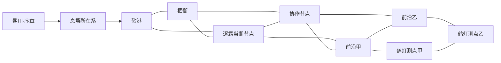

# 从已知宇宙到第一张可玩的星图

v0.2 · 2026-09-23 · 推荐尺度稿，尚未替换已发布正典。

承接 [ML-01主线框架](https://github.com/StellarEchoesGame/worldbuilding/issues/27#issuecomment-5797244460)。本稿把“首个上线版本”按一段能够完成求生、接触文明、主动远征及收束的完整体验定义；它大于原型试玩，不预设工期、团队产能或游戏时长。图面数据见 [atlas.json](atlas.json)，审读见 [REVIEW.md](REVIEW.md)。

## 一、推荐采用的尺度

**宇宙背景覆盖银河与更远的天文视野；人类长期生活在跨度约1000光年的不连续航路网络中。归航号位于距太阳约500光年的边缘分支，其所在星域约80光年宽；首发只开放其中约40光年跨度的一张有分支的航图。**

除现实宇宙背景外，以下数字都是本轮选定的创作量级。约数用于约束叙事，不伪装成观测值或已运行的模拟参数。

| 层次 | 推荐范围 | 这句话实际承诺什么 |
| --- | --- | --- |
| 天文观测的宇宙 | 银河及遥远河外对象，不划单一全知半径 | 看得到天体或信号，资料有光龄、波段、分辨率和不确定度；并非知道当地现状 |
| 本航区共享的可核验实访档案 | 包含个别距太阳约3000光年的远征点位 | 载人或自动先遣的离散记录；不代表其间天体都去过，也不代表可定期往返；不是全人类最远航行纪录 |
| 主要常住与常规通航网络 | 最大跨度约1000光年，多数远端节点距太阳数百光年 | 从太阳系外拓形成的枝状网络，有空洞、断续和不同历史；不是半径1000光年的实心文明球 |
| 归航号的区域位置 | 距太阳约500光年的一条边缘分支 | 这里远离高密度接续线路，但与人类其他地方仍有关系；不是银河物理边缘 |
| 当地星域 | **远汐星域**，工作名，最大跨度约80光年 | 多个恒星系组成的地理区域；没有统一星域政府的默认设定 |
| 首发可访问星图 | 约40光年整体跨度，**8个恒星系＋2个星际观测节点** | 选择了其中可深入体验的目的地，不意味着这片空间只有8个恒星系 |
| 息壤 | 其中一个恒星系内，外围行星的卫星—环带作业群 | 属首发新手区域；冷湾、赤脊、帘影是3个局部内容区，息壤不等于整系 |
| 实际操作与生活 | 16个重点区域，加一套持续随船的母舰空间 | 港区、作业场、观测空域等；不承诺整颗星球任意落地或40光年连续手动飞行 |

现实参照：NASA将银河系恒星盘描述为超过10万光年的尺度，并指出我们能观测其他星系。它支持宏观量级，**不支持或验证本作的1000、500、80、40光年与跃迁假设**。[NASA：Galaxy Basics](https://science.nasa.gov/universe/galaxies/)（2026-09-23，内置浏览器核读）。

## 二、“已知”不应该只有一条边界

一颗已经被望远镜发现的恒星，依然可能没有探测器去过；有先遣回来的地方，依然可能没有能住人的港口。所谓未知，应明确缺的是哪一种信息。

| 地图上的知识 | 例子 | 玩家如何使用 |
| --- | --- | --- |
| 观测记录 | 恒星光谱、行星候选、尘带亮度，附取得时间与光龄 | 选择值得调查的目标，不能由此承诺安全落点和可采产率 |
| 实地记录 | 先遣轨迹、样本与抵达空域的测量 | 制定下一次验证或航行，检查记录是否适用于当下 |
| 航路保障 | 可供当前载具使用的经过校验的航段 | 比较工质、进近、冷却和绕行；不是一条强制星门通道 |
| 生活与服务 | 谁能接纳、修什么、何时有运力或床位 | 判断一条路线是否真能支持这一船人的生活 |

人类会研究银河另一侧或河外天体，但目前主要文明活动仍限于很小的一部分银河。即使在常住网络内部，也有大量未详查的天体和未被本舰理解的社会。因此不需要把文明推到银河之外才能产生未知。

主要常住网络的1000光年是**最大端点间跨度**，而500与3000光年是**到太阳的距离**。地图必须分别标识这两种量，不能一会儿当直径、一会儿当半径。3000光年定义本航区可交叉核验的一档远征资料覆盖，不定义人类绝对足迹上限；其他网络可能保有更远资料，“没有进入这份星图”不能推出“从未有人到过”。

## 三、为什么选择这档人类扩张尺度

沿用航约纪年428，并把它看成持续拓航历史中的协定历，早期恒星系内居住史更久。约500光年的远端节点若以428年作粗略时间窗，其向外建立接续的平均进度约1.2光年/年。这个除法只是尺度检查；殖民推进并非匀速球面，也不能由此推出建成日期。

本作允许跃迁，**船飞得快不等于社会扩展得同样快**。先遣可以携小载荷到很远的点，稳定生活还需要迁入者、设备复制、专业工艺、备用能力和持续往来。3000光年的孤立实访档案因此可以对应1000光年常住网络之外的地方，个别记录甚至已经很旧。后续应选取一个例子写清远征保障与资料回传；单有跃迁速度不能证明完整往返或记录已经送达。

这档范围允许数代社会分化与多个成熟地区，也保留与太阳系有历史连续性的感觉。远端人可以读旧地球文学，却更熟悉本地星港；同一种工业设备会有不同地方版本。母舰的居民要按月照顾、学习和生活，不能把跨网远行变成一次短暂离席。

不采用两种极端：把人类活动压进首发附近的几套恒星系，会使太阳系、散居史和跃迁沦为布景；把成熟文明铺满大半银河，则要重新解释为什么边缘节点仍缺可靠保障，也会大幅改变当前作品的尺度和主题。

## 四、归航号究竟处在怎样的星域

**推荐定义：远汐星域是人类主要通航网旁的一片约80光年宽的边缘区域，晷川是其中一个恒星系，息壤是邻系的一小片可作业区域。**

“边缘”主要描述接续密度和调查程度。它不是落后文明的统一等级：砧港具有成熟工业能力；栖衡有专业的居住、医疗及生态服务；逐霜拥有适应移动生活的工艺和社会安排。这些能力互补，不能替代成三座无所不能的大型工业港。

三种名称不可混用：

- **远汐星域**是地理范围，包含本轮没有写出的恒星系与社会。
- **远汐支线及其旁支**是航路网络的一部分，节点可在不同政治关系下合作。
- **砧港、栖衡、逐霜**是共同体及其设施关系，不是一星一国。尤其逐霜的当期停靠位置会变，星图记录“在哪里、记录何时形成”，不把它固定成一颗行星。

晷川的长耀期按本地恒星灾变处理。若其后果影响星域其他地方，应通过供应、难民、贸易与消息传播发生；不能把辐射直接写成80光年同时扫灭文明。

息壤内部继续采用冷湾冰卫星盆地、赤脊岩卫星作业地、帘影环带观测区。它们属于同一外围行星的局部任务群。区域之间的实际距离、轨道相位与日内往返窗口仍需单独设计；“同一行星附近”不能替代交通预算。

## 五、首发选择8系、2节点、16区

这个数量是首发内容上限提案，承担一段完整主线。它不表示做出16个同质场景就足够，也不表示其制作量已经估算通过。

**重点区域**定义为：拥有完整进入、行动、结果及可辨认空间的内容单元；可以是港区的一部分、一次冰原作业范围或一个星际观测部署点。它不是天体计数、任务计数或引擎场景文件计数。下表各行的区域互不重复。

| ID与目的地 | 类型 | 重点区域 | 数量 | 首发职责 |
| --- | --- | --- | ---: | --- |
| S0 晷川 | 恒星系 | 外围接应与撤离空域 | 1 | 可操作序章，认识失去的班期与接应者；首发不承诺自由重访灾区 |
| S1 息壤所在系 | 恒星系，正式系名待选 | 冷湾、赤脊、帘影 | 3 | 学会生存、外勤与初次科学发现，准备下一次航行 |
| S2 砧港所在系 | 恒星系 | 港区生活与维修接待；外部工业作业区 | 2 | 母舰修整、工艺与市场、人们真实的去留选择 |
| S3 栖衡节点所在系 | 恒星系 | 公共生活与接待区；生态生产维护区 | 2 | 另一种共同生活方式，长期服务与互保关系 |
| S4 逐霜当期节点所在系 | 恒星系 | 移动培养群与冰栈的交接空域 | 1 | 移动文明、班期与家户关系；不展开全部迁徙网络 |
| S5 协作节点所在系 | 恒星系 | 共同使用的转运与远征准备场 | 1 | 接续前沿作业，由已有参与者合作，不新增一个国家 |
| S6 前沿甲 | 恒星系，工作代号 | 自然调查区；设备部署与取样区 | 2 | 建立观测基线、处理陌生条件，具体自然题目后续选择 |
| S7 前沿乙 | 恒星系，工作代号 | 环境调查区；当地作业队活动区 | 2 | 与甲不同的方法和利益冲突，地方日程独立推进 |
| I0 鹤灯测点甲 | 星际空间节点 | 尘带近侧观测部署区 | 1 | 一组具有明确位置和光龄的证据 |
| I1 鹤灯测点乙 | 星际空间节点 | 另一视点的观测部署区 | 1 | 与前一组资料相互检验，形成当期科学问题的结果 |
| **合计** | **8系＋2星际节点** | **1个序章区＋15个可再访区** | **16** | **完成求生、文明接触与一场自主远征** |

母舰是一套持续随航线变化的家园空间，单独列范围，不在每个恒星系重复计入16区。大量远景天体、背景星点、记录中的外部港口也不计为可玩区域。首发有3个作为可再访内容中心的外部共同体：砧港、栖衡、逐霜；此外还有归航号自身和序章/后续消息中的晷川幸存者。这是内容中心的计数，不是宣布宇宙只存在3种社会。

前沿甲、乙的具体自然机制尚未选定，16区因此是**容量分配**，不是16份已经完成的任务设计。后续每区都要说明独有的观察/操作、人物或物理结果以及再访变化；没有独特职责的区域应合并，不能靠换贴图凑数。

不强制玩家为看结局走完所有区域。主线完成可选择合作对象与准备路径，其他区域提供不同关系、方法或发现。15区“可再访”指版本提供再入内容，实际可用时间仍受已声明事件、班期与安全状态影响。

一个重点区域可以包含多条局部路线、观察位置和可重复开展的作业，不等于一个房间或一件任务。首发优先固定主要节点的职责与地理关系，在区域内部按共同规则形成环境、作业和地方经历的差异；本稿没有开发生成器。已经出现的证据仍约束地方过去，生成变化不能为某次选路临时补出燃料或修改灾害史。

## 六、这张星图必须是一张网

作者示意拓扑如下。线代表本版本计划详细处理的航段，不代表瞬间可达，也不取消有足够证据和资源时进行其他直接航行的物理可能。

这里有两个有不同收益的准备方向：栖衡更适合建立服务、培养备份与人员接续；逐霜更适合移动作业、驻点轮换与前沿经验。它们不应只成为同一购物清单的两个商店。协作节点支持交接，但可经逐霜直接前往前沿甲，避免把某个供给人写成唯一门钥匙。具体物资配置与替代成本要在航程账中验证。

重要回访应能呈现由时间或行动造成的变化：履约交接、班期变更、技术方法改进、来去的人或新的观测。变化有自己的发生时间；短时间重入同一地点可以维持原状，不能每进一次区域就生成一件新事件。同一世界内改换访问顺序也不能改写已有的过去。

`atlas.json`给出固定作者示意坐标，单位光年；原点是局部任意参考，不是太阳。它只用于核对40光年跨度和分支关系，不是实际天体目录，也不是游戏数据接口。星际测点是指定观测空域，鹤灯源星不因此被算成另一处可访问恒星系；这10个点也不等于该空间全部恒星。

示意中的各边可逆性只描述图结构；晷川这一序章节点首发没有自由重访内容。不能从图上的无向线推出无条件往返、即刻通行或原路消耗对称。

## 七、光年必须产生可理解的时间和生活

供推演采用的初始航行口径：相邻民用航段一般为**6—15光年，完整转场约3—10个世界内日**，包括准备、跃迁、进近和冷却；不是恒定速度定律。个别已经部署好的近距测站间转场可以落在这个距离区间之外，须另列状态。

按10光年、6日一段的纯示例，500光年的太阳系方向直线路程已需约50段、300日；实际航线和接续可能更长，最快信使也可能采用不同载荷与排程。由此可支持一年以上的跨网往返，却不能把它写成所有消息至少延迟一年的物理规则。首发40光年的地图直径同样不等于只走40光年就能完成全部路线。

首发横穿主要航路应是数周量级，完整自主远征的数月还包含部署、调查、维修与驻留。世界内时间通过航程、生活变化和叙事节奏呈现，不要求玩家实时等待几个月，也不能所有内容靠连续读条带过。

系统后果需要进到场景里：补给节点有轮班与运力；居民的学习、照护和康复继续发生；要去陌生城市的人能知道何时轮到自己的休息。共享生命保障使这些安排重要，但不会自动导出统一宗教、公民身份或全员必须爱远行。

## 八、新星图对开场提出的真正问题

**本稿选择新的尺度建议，同时撤回“旧60日库存、110日援助和原J账已证明新地图开场成立”的推定。** 旧稿原文保留为历史证据；这些数值在新尺度下处于待重算状态。不能把缩放后的地图和原通过结论拼成新正典。

最重要的反例是：既然40光年内有多个有人节点，是否已经有一条能及时补给或转运居民的方案？信使能到不保证货到，但不能仅重复这句话。必须列出灾变当刻各节点已有的合格物资、载具、载荷、当前位置、改航可能与交付时间，且包含民间和小艇累计能力。

砧港需要有真实工业优势；栖衡、逐霜也拥有能帮助人的能力。不能为了保留单程逃亡而临时把所有仓库都说成空的、所有船都说成坏的。原110日只能是某次具体可用大宗航次的排程结果，不能当整个星域的通行时间。

第一次启航必须重新通过这些反证：直接去港是否可行；派艇采购或运送人员是否可行；附近替代产线能否及时接续；原域等待是否有现实收益。若有更好方案，就改开场库存、任务位置或事件时序中有真实依据的部分，并承认故事发生变化；不靠越补越多的事故封死它。

息壤之后的航程另算：先遣样本→批量净产率→工质制备→携带库存→途中消耗→到港能力。1.03当地供给不能自动成为航行期间的采集收入，更不能证明第47日已经攒够下一跳。现场资源分布也不随玩家选择路线而重写。

## 九、首发怎样结束，世界又怎样继续

首发完成一场主动远征：对鹤灯当期科学问题取得足以支持或修正解释的证据，把人和设备带回母舰，并在已约定的合作节点完成交接与修整。它可以回砧港，也可以回栖衡或协作节点；不必回息壤。

结尾要让玩家看见已获得的能力、改变的关系和一次真实发现。第一张星图内仍可有后续活动，远方星表则保留更大的世界。不会把“现在终于能去探索了，等待下次更新”当成本版本高潮。

产品边界须诚实显示：已知但本版本未开放、当前尚未获得安全资料、正在变化暂不可作业，是三个不同状态。不能把整个银河涂成战争禁区或以神秘墙解释首发内容限制。首发界面优先呈现当前相关航点，其他地点可检索而不同时变成任务按钮。

## 十、技能审查后的取舍

| 检查方法 | 本轮得到的约束 |
| --- | --- |
| 中文世界观审查 | 大范围必须转化成地图、航路、消息与场面；少用精确数字制造深度。观测、居住、可玩不能互相冒充 |
| 系统后果推演 | 跃迁速度→实访范围→工业接续→居住分布→组织选择→人物生活逐层检查，政治结构不能只由距离推出 |
| 循环文化检查 | 航程要容纳持续生活；母舰必须带来照护、家庭和现场保障的收益，不能凭循环系统强迫所有人同航 |

2—3系可以作为验证切片，但会挤压本次承诺的文明差异和主动远征；8系＋2节点能形成可回访的关系网；几十或上百系会显著增加原创内容负担，目前没有产能证据支持。选择本档后，如制作验证需要缩减，优先合并重复职责，保留主线收束、两条准备路径、自然发现和母舰生活。

下一份应先做**首发航图与启航条件的联合推演**：在该范围里核对历史、消息、运力和两次出航，再进入第一航程梗概。它会调整ML-01原先直接写梗概的顺序。当前只交付尺度和内容边界，不恢复模型、美术、视频或游戏功能制作。
